## Table 1: First Test Run

| Code | Code Snippet                       | Task Description | Proposed Facets                 | Detected Problems                     | Improvements      |
|------|------------------------------------|----------------- |---------------------------------|---------------------------------------|-------------------|
|Fr1x1 |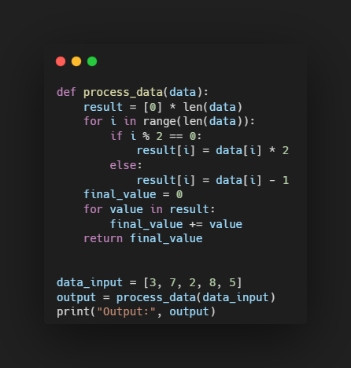|Loop & Index Understanding|Analytical, Abstraction |Only reliably tests analytical thinking|Focus solely on the cognitive facet of analytical thinking|
|Fr1x2 |See code snippet Fr1x1|Edge Case Handling|Abstraction|Requires language-specific knowledge; primarily tests analytical thinking|Delete task|
|Fr1x3 |See code snippet Fr1x1|Flowchart Comparison|Analytical, Abstraction|Did not require either abstract thinking/analytical thinking; made rule-based thinking easy |Provide several flowcharts that can reflect different aspects|
|Fr2x1 |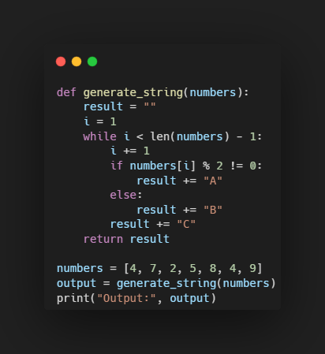|Detect Output|Analytical, Abstraction|Only reliably tests analytical thinking|Focus solely on the  cognitive facet of analytical thinking|
|Fr2x2 |See code snippet Fr2x1|Assigning Inputs to Outputs|Analytical, Abstraction|Presentation format and task are not very intuitive and are too complex|Delete task|
|Fr2x3 |See code snippet Fr2x1|Detecting Correct Statements on Behavior|Analytical, Abstraction|Ambiguous evaluation scheme (binary, even though multiple answers may be correct); the focus is mainly on the ability to think abstractly|Focus solely on the cognitive aspect of abstract thinking; Rating system expanded
|Fr3x1 |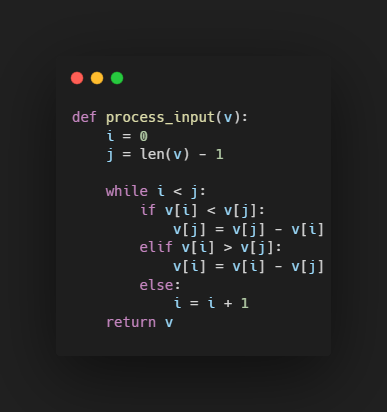|Method Naming|Analytical, Abstraction|Code too complex; None of the intended aspects are reliably tested due to poor results, though there is a tendency towards abstract thinking|Simplify the code; focus on abstraction|
|Fr3x2 |See code snippet Fr3x1|Error Detection|Analytical, Abstraction, Critical|only reliably assesses analytical and critical thinking|Focus on only one cognitive facet
|Fr4x1 |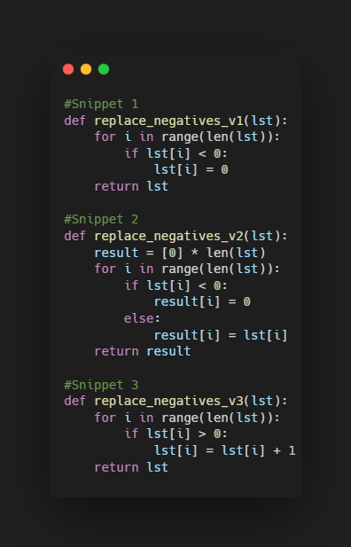|Code Snippet Comparison|Analytical, Abstraction, Critical|Ambiguous marking scheme (binary, even though multiple answers may be correct); the distinctiveness of the facets is not guaranteed due to additional cognitive demands|Rating system expanded; Focus on critical thinking|
|Fr5x1 |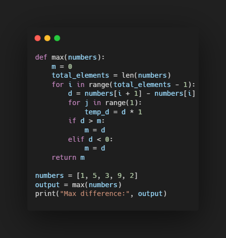|Functionality Check|Analytical, Abstraction, Critical|Code functionality already tested in Fr4x1|Delete task|
|Fr5x2 |See code snippet Fr5x1|Code Evaluation|Critical|Participants have already linked Fr5x2 and Fr5x3 in their answers|Combine Fr5x2 and Fr5x3 into one task|
|Fr5x3 |See code snippet Fr5x1|Code Improvement|Critical|-|Adapt phrasing of the task so that it includes Fr5x2|

## Table 1.1: First Test Run - Tasks and Answers

| Task | Question | Answers | Correct Answer |
|------|----------|---------|----------------|
|Fr1x1 | "What does the given code do?" | a) It doubles the even-indexed elements of the list and decreases the odd-indexed elements by 1, then returns the sum of the modified list.   b) It creates a new list where even-indexed elements are doubled and odd-indexed elements are decreased by one, then returns the modified list.   c) It modifies the input list by multiplying elements at even indices by 2 and subtracting 1 from odd-indexed elements, then calculates and returns the sum of that list. | a) It doubles the even-indexed elements of the list and decreases the odd-indexed elements by 1, then returns the sum of the modified list. |
|Fr1x2 | "How does the code behave if the input list data_input is empty?"| a) The code returns an error message.   b) The code returns 0.  c) The code returns None.|b) The code returns 0.|
|Fr1x3 | "Please select the flowchart that reflects the code." |-|-|
|Fr2x1 | "What is the output of the following code?" | a) BCACBCBCAC   b) BCBCACBCAC   c) CACBCACBC | a) BCACBCBCAC |
|Fr2x2 | "Please assign the following inputs to their corresponding outputs." | Inputs &nbsp; &nbsp; &nbsp;&nbsp; &nbsp;&nbsp; &nbsp;&nbsp; &nbsp; &nbsp; &nbsp; &nbsp; &nbsp; &nbsp; Outputs   A = [4, 7, 2, 5, 8, 4] &nbsp; &nbsp; 1 = "BCACACBC"   B = [6, 3, 5, 8, 2, 4] &nbsp; &nbsp; 2 = "ACACBCBC"   C = [7, 9, 1, 3, 8, 6] &nbsp; &nbsp; 3 = "BCACBCBC"   D = [3, 6, 2, 1, 7, 8] &nbsp; &nbsp; 4 = "ACBCBCBC"   | A = 3   B = 4   C = 2   D = 1 |

## Table 2: Second Test Run

| Code | Task Description | Code Snippet | Tested Facet | Explanation |
|------|------------------|--------------|--------------|-------------|
|Q1x1 (former Fr1x1)|Loop & Index Understanding|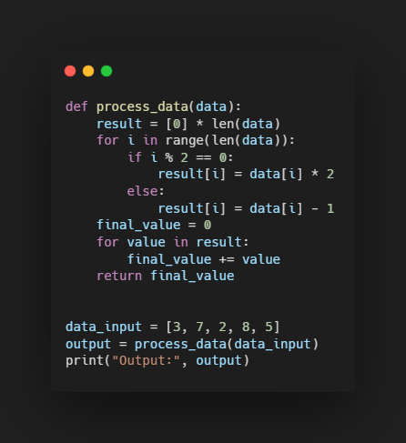|Analytical|Tests analytical thinking by requiring students to trace the code step by step, analyze loops and conditions, and distinguish subtle differences in the answer choices.|
|Q1x2 (former Fr1x3)|Flowchart Comparison|See code snippet Q1x1|Depends on Flowcharts and their errors|-|
|Q2x1 (former Fr2x1)|Detect Output|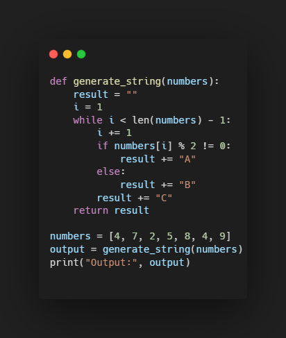|Analytical|Tests analytical thinking by requiring students to mentally trace the program flow, follow loop and condition behavior step by step, and recognize how the output string is constructed.|
|Q2x2 (former Fr2x3)|Detecting Correct Statements|See code snippet Q2x1|Abstraction|Participants must move beyond tracing single outputs and instead understand the general behavior and structure of the program. They need to integrate loops, conditions, and index handling into an overall understanding of how the function operates for different inputs.|
|Q3x1 (former Fr3x2)|Error Detection|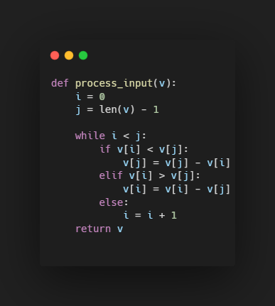|Critical|Participants must not only trace how the code works, but also evaluate whether it behaves correctly for different inputs. They need to compare multiple test cases, identify edge cases that reveal logical flaws, and judge whether the algorithm achieves its intended purpose or fails under certain conditions.|
|Q4x1 (former Fr3x1)|Method Naming|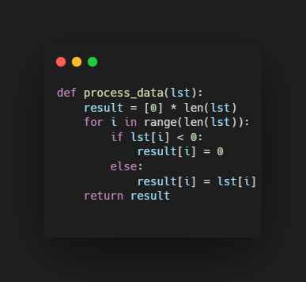|Abstraction|Participants must identify the overall purpose of the code and translate its behavior into a meaningful conceptual description. Instead of focusing only on individual lines, they must integrate the conditions and data processing into an understanding of the algorithm’s function and express it through an appropriate method name.|
|Q4x2 (former FR4x1)|Code Snippet Comparison|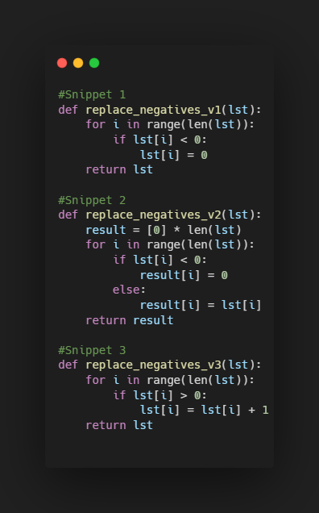|Critical|Participants must evaluate each code snippet against a formal specification and judge whether it correctly implements the required behavior. They need to detect correctness (does it preserve non-negative values and replace only negatives), and distinguish subtle logical differences between similar implementations rather than just understanding the code flow.|
|Q5x1 (former Fr5x3)|Code Improvement|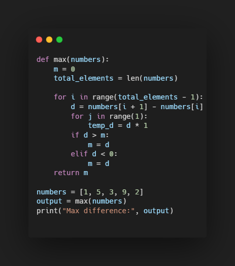|Critical|Participants must evaluate the code beyond its output, focusing on correctness, efficiency, and readability. They need to identify logical errors (incorrect max calculation), unnecessary computations, and poor design choices, and then justify improvements such as simplifying the structure and removing redundant operations.|

## Table 2.1: Second Test Run - Tasks and Answers

| Task | Question | Answers | Correct Answer |
